## 需要关注的网站

官网-`nodejs.org`

模块社区-`www.npmjs.com`

技术社区-`stackoverflow`

## 安装nodejs

之前搭建hexo博客,我花费了大量的精力搞了这些鬼东西.

官方描述:<br>
`
Node.js®是在Chrome的V8 JavaScript引擎上构建的JavaScript运行时。Node.js使用事件驱动的非阻塞I / O模型，使其轻量且高效。Node.js的软件包生态系统npm是全球最大的开源库生态系统。
`

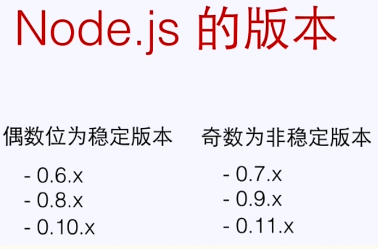

## 起一个web服务器

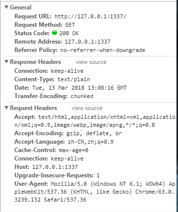

跟tomcat差不多,修改了东西,就要重启服务器`node xxx.js`,刷新页面就可以了.

## 命令行来比较浏览器环境和node里面的JS的不同之处.

chrome里面F12的console环境下:
```
var a = 1;
var b = 2;
var add = function(a,b){return a+b};
console.log(add(a,b))
```
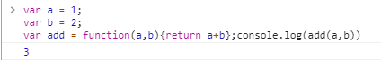

node环境下进行测试:

输入`node`,进入node环境了.

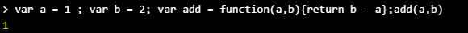

浏览器里面的window

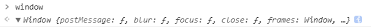

node里面有大量的`process`,运行一下会看到很多.

## Node.js的模块与CommonJs规范

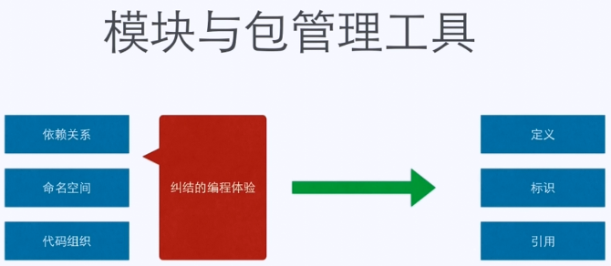

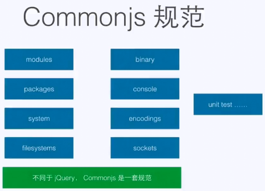

主要就是分为3个部分:模块的定义,模块的标识,模块的引用.

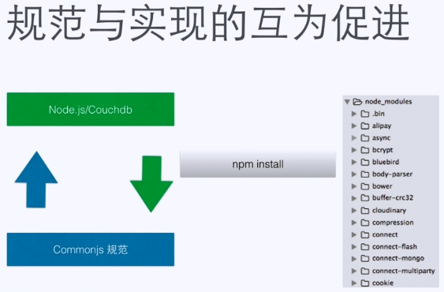

## 模块的分类

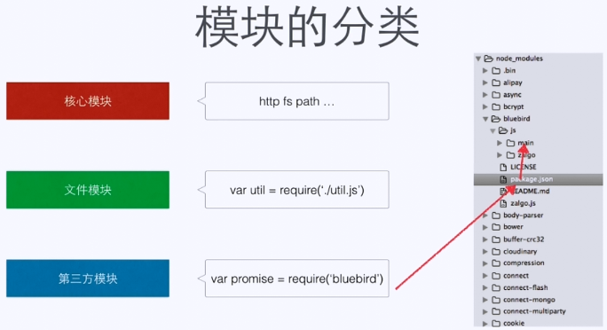

## 模块的流程

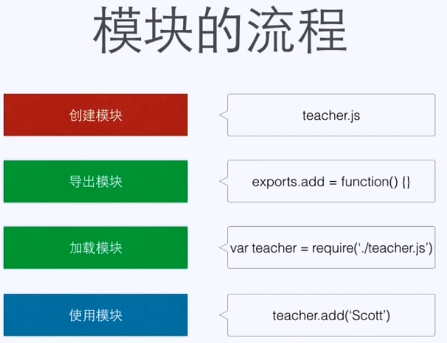

理解
```
一个模块就是一个文件

如果你想要你的模块成为一个特别的对象类型，那么请使用module.exports；

如果你希望你的模块成为一个传统的模块实例，那么请使用exports

流程:

创建模块，导出模块，加载模块，使用模块；创建之后立马导出(module.exports),加载模块 var a = requier('url')；

```

测试代码
1.假设有一个学校模块

`本质就是一个文件夹`

2.里面有学生和老师`student&&teacher`

student.js

```
function add(student) {
  console.log('Add student'+ student);
}

exports.add = ad
```

teacher.js
```
function add(teacher) {
  console.log('Add teacher'+ teacher);
}

exports.add = ad
```

3.学生和老师组成一个班级`klass`

klass.js

先引入`student`与`teacher`,再将2者组合到一个函数中操作.
```
var student = require('./student');
var teacher = require('./teacher');

function add(teacherName,students) {
  teacher.add(teacherName)
  students.forEach(function(item,index){
    student.add(item)
  })

}
exports.add = add
//module.exports = add
```

4.输出模块内容`index`
index.js
```
var klass = require('./klass')

klass.add('Scott',['小明','小红']
```

引入上面的js,调用里面的函数.

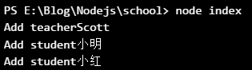

5.暴露这个school模块

```
exports.add = function (klasses){
  //进入klass对象内部
  klasses.forEach(function(item,index){
    //对象内部的东西,就是老师姓名和学生数组
      var _klass = item
      //老师姓名
      var teacherName = item.teacherName
      //学生数组
      var students =item.students

      klass.add(teacherName,students)
    })
}
```

## Node.js的API

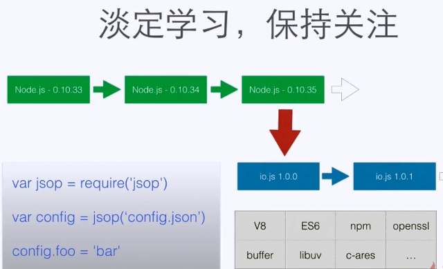

## URL网址解析工具

1.url解析地址

`url.parse('xxx')`
```
> url.parse('http://luoyupiaoshang.club/2018/02/08/区块链/')
Url {
  protocol: 'http:',
  slashes: true,
  auth: null,
  host: 'luoyupiaoshang.club',
  port: null,
  hostname: 'luoyupiaoshang.club',
  hash: null,
  search: null,
  query: null,
  pathname: '/2018/02/08/区块链/',
  path: '/2018/02/08/区块链/',
  href: 'http://luoyupiaoshang.club/2018/02/08/区块链/' }

```

更加完全的展示

```
> url.parse('http://luoyupiaoshang.club:8080/2018/02/08/区块链?from=ligang=node#
floor1')
Url {
  protocol: 'http:',
  slashes: true,
  auth: null,
  host: 'luoyupiaoshang.club:8080',
  port: '8080',
  hostname: 'luoyupiaoshang.club',
  hash: '#floor1',
  search: '?from=ligang=node',
  query: 'from=ligang=node',
  pathname: '/2018/02/08/区块链',
  path: '/2018/02/08/区块链?from=ligang=node',
  href: 'http://luoyupiaoshang.club:8080/2018/02/08/区块链?from=ligang=node#floo
r1' }
```

另外一个版本,最后面,加一个true,query字段有了变化.

```
> url.parse('http://luoyupiaoshang.club:8080/2018/02/08/区块链?from=ligang=node#
beautiful',true)
Url {
  protocol: 'http:',
  slashes: true,
  auth: null,
  host: 'luoyupiaoshang.club:8080',
  port: '8080',
  hostname: 'luoyupiaoshang.club',
  hash: '#beautiful',
  search: '?from=ligang=node',
  query: { from: 'ligang=node' },
  pathname: '/2018/02/08/区块链',
  path: '/2018/02/08/区块链?from=ligang=node',
  href: 'http://luoyupiaoshang.club:8080/2018/02/08/区块链?from=ligang=node#beau
tiful' }
>
```

再来一种测试

```
> url.parse('//imooc.com/course/list',true,true)
Url {
  protocol: null,
  slashes: true,
  auth: null,
  host: 'imooc.com',
  port: null,
  hostname: 'imooc.com',
  hash: null,
  search: '',
  query: {},
  pathname: '/course/list',
  path: '/course/list',
  href: '//imooc.com/course/list' }
```

总结:
```
url.format("地址")  生成url地址

url.resolve("HTTP://imooc.com",'/course/list');生成url地址

url.parse("地址")；解析url地址成分
```
## QueryString参数处理

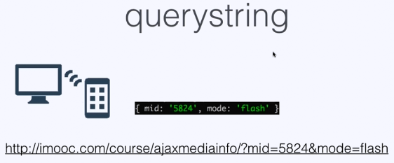

序列化的过程:

```
> querystring.stringify({name:'ligang',course:['jade','node'],from:''})
'name=ligang&course=jade&course=node&from='
> querystring.stringify({name:'ligang',course:['jade','node'],from:''},',')
'name=ligang,course=jade,course=node,from='
> querystring.stringify({name:'ligang',course:['jade','node'],from:''},',',':')
'name:ligang,course:jade,course:node,from:'
>
```

反序列化过程
```
> querystring.parse('name=ligang&course=jade&course=node&from=')
{ name: 'ligang', course: [ 'jade', 'node' ], from: '' }

> querystring.parse('name=ligang,course=jade,course=node,from=',',')
{ name: 'ligang', course: [ 'jade', 'node' ], from: '' }

> querystring.parse('name:ligang,course:jade,course:node,from:',',',':')
{ name: 'ligang', course: [ 'jade', 'node' ], from: '' }
```

转义&&反转义
```
> querystring.escape('<哈哈>')
'%3C%E5%93%88%E5%93%88%3E'
> querystring.unescape('%3C%E5%93%88%E5%93%88%3E')
'<哈哈>'
```
## HTTP知识

HTTP是一种协议.

**大致流程**:
```
HTTP客户端发送请求,创建端口

HTTP服务器在端口监听客户端请求

HTTP服务器向客户端返回状态和内容
```


**详细过程**
```
1.Chrome搜索自身的DNS缓存
  查看浏览器DNS缓存记录`chrome://net-internals/#dns`

2.搜索操作系统自身的DNS缓存(浏览器没有找到缓存或者缓存已经失效)

3.读取本地的HOST文件

4.浏览器发起一个DNS的一个系统调用.
    1.宽带运营商服务器查看本身缓存.
    2.运营商服务器发起一个迭代DNS解析的请求.
    3.运营商服务器把结果返回操作系统内核同时缓存起来.
    操作系统内核把结果返回浏览器.
    最终浏览器拿到了www,imooc.com对应的IP地址.

5.浏览器获得域名对应的IP地址后,发起HTTP"三次握手".
      浏览器找一个端口,发起TCP连接请求,通过层层的路由设备,到达服务器端的网卡.
      然后进入到内核的TCP/IP协议栈,还可能经过防火墙的过滤.最终到达web服务端.然后建立了TCP/IP的连接.

6.TCP/IP连接建立起来后,浏览器就可以向服务器发送HTTP请求了,比如说,用HTTP的GET方法请求一个根域里的一个域名,协议可以采用HTTP1.0的一个协议.

7.服务器端接受到了这个请求,根据路径参数,经过后端的一些处理之后,把处理后的一个结果的数据返回给浏览器,如果是imooc的页面就会把完整的HTML页面代码返回给浏览器.

8.浏览器拿到imooc的完整的HTML页面代码,在解析和渲染这个页面的时候,里面的JS,CSS,图片静态资源,他们同样是一个个HTTP请求,都需要经过上面的主要的7个步骤.

9.浏览器根据拿到的资源对页面进行渲染,最终把一个完整的页面呈现给了用户.
```

## HTTP的协议

**请求和响应**:都包含HTTP头和正文信息

**HTTP头和正文信息**

HTTP头发送的是一些附加的信息:内容类型,服务器发送响应的日期,HTTP状态码

正文就是提交的表单数据.

## 分析慕课网

地址`http://www.imooc.com/course/list`

具体分析:

**Headers**
```
General

Request URL:http://www.imooc.com/course/list
Request Method:GET
Status Code:200 OK
Remote Address:115.182.41.180:80//远端服务器地址,url解析后的地址.
Referrer Policy:no-referrer-when-downgrade

Response Headers

HTTP/1.1 200 OK
Server: nginx
Date: Tue, 13 Mar 2018 15:51:17 GMT
Content-Type: text/html; charset=utf-8
Transfer-Encoding: chunked
Connection: keep-alive
Vary: Accept-Encoding
Expires: Thu, 19 Nov 1981 08:52:00 GMT
Cache-Control: no-store, no-cache, must-revalidate, post-check=0, pre-check=0
Pragma: no-cache
Set-Cookie: imooc_isnew=2; expires=Wed, 13-Mar-2019 15:51:17 GMT; path=/; domain=.imooc.com
Set-Cookie: cvde=5aa7c6759b5f5-89; path=/; domain=.imooc.com
Content-Encoding: gzip

Request Headers

GET /course/list HTTP/1.1
Host: www.imooc.com
Connection: keep-alive
Cache-Control: max-age=0
Upgrade-Insecure-Requests: 1
User-Agent: Mozilla/5.0 (Windows NT 6.1; WOW64) AppleWebKit/537.36 (KHTML, like Gecko) Chrome/63.0.3239.132 Safari/537.36
Accept: text/html,application/xhtml+xml,application/xml;q=0.9,image/webp,image/apng,*/*;q=0.8
Accept-Encoding: gzip, deflate
Accept-Language: zh-CN,zh;q=0.9
Cookie: imooc_uuid=02da4250-2a70-4c22-8e5c-6ff9ee8544a7; imooc_isnew_ct=1503238835; UM_distinctid=15fb34d594615c-0f99f930e89b36-5e163117-100200-15fb34d59481a4; CNZZDATA1261110065=234894655-1510537974-https%253A%252F%252Fwww.baidu.com%252F%7C1510537974; Hm_lvt_c92536284537e1806a07ef3e6873f2b3=1515745291; CNZZDATA1261728817=1071090527-1515740417-%7C1515740417; imooc_isnew=2; loginstate=1; apsid=cyNmI0MDM3YWJjMGFmZThmNjVmYzI3NDFkY2U0YTcAAAAAAAAAAAAAAAAAAAAAAAAAAAAAAAAAAAAAAAAAAAAAAAAAAAAAAAAAAAAAAAAAAAAAAAAAAAAAAAAAAAAANDg4MzE5MAAAAAAAAAAAAAAAAAAAAAAAAAAAAAAAAAAxNzYzMjk2NTY0QHFxLmNvbQAAAAAAAAAAAAAAAAAAAGU3NzczY2RhODlmYjBkOTgyNDRkODE3OTExM2Q2ODNmqieOWqonjlo%3DMj; PHPSESSID=i1eeoamesr42s1tifdl6ghth15; Hm_lvt_f0cfcccd7b1393990c78efdeebff3968=1520428318,1520466824,1520840240,1520944765; mc_channel=banner; mc_marking=01079dfa69736804ab86e609cd0041be; CNZZDATA1273093942=959068730-1520943812-%7C1520943812; IMCDNS=0; cninfo=banner-d7163aeee9a5eab550a14cc2b699c976; cvde=5aa7c6759b5f5-88; Hm_lpvt_f0cfcccd7b1393990c78efdeebff3968=1520956268

```

Timing--各个阶段耗费的时间,可以寻找页面之所以慢的瓶颈在哪个地方.
```
Stalled--浏览器发出请求到可以发出请求需要的等待时间
Proxy negotiation--代理协商的时间
Request sent--请求第一个字节发出以前到最后一个字节发出后的时间.(上传时间)
Waiting(TTFB)--请求发出以后到收到响应第一个字节的时间.也包括一些延迟时间.
Content Download--收到响应的第一个字节开始到接收完毕后的最后一个字节后所需要的时间.(下载时间)
DNS-lookup--域名解析的时间
```

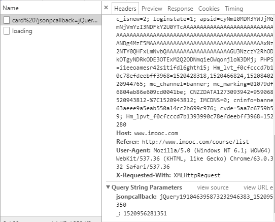

### 状态码

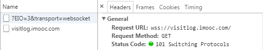

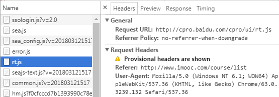

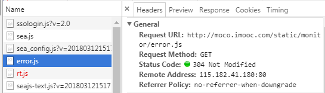
```
1xx --请求已接收,等待处理.
2xx --请求已接收,并已经处理.
3xx --重定向,请求还需要进一步处理.
4xx --客户端出错,语法错误或者无法实现.
5xx --服务器端出错,无法实现合理的请求.

400 -- 客户端请求有语法错误,服务器端无法理解.
401 -- 请求没有经过授权.
403 -- 服务器收到请求,拒绝提供服务,没有权限.
404 -- 资源不存在.
500 -- 服务器端出现了一个不可预知的错误.
503 -- 服务器不能处理当前客户单的请求.
```
### 请求方法

```
GET--读取数据
POST--
PUT--更新数据,向指定的资源路径下更新内容
DELETE--删除服务器中某个标识的资源
HEAD--指定资源的请求,但是它不传输正文内容,好处就是,是这个方法不用传输所有的内容,就可以获取里面原信息的元数据.
TRACE
OPTIONS
```

## HTTP模块

支持更多特性,

不缓冲请求和响应.

处理流相关.

## HTTP概念

1.什么是回调?
2.什么是同步/异步?
````
同步就是执行一个任务,后面一个任务等待前一个任务结束,才能执行.程序的执行顺序和任务的排列顺序是一致的.浏览器端的JS是单线程的.因此JS代码只能按照顺序执行.如果JS代码里面有死循环,页面就会被阻塞在这个地方.后面的代码就会执行不到.

脚踏多只船,就是多线程的情况.能够分配资源,充分利用CPU.
````
1.同步的情况.
```
//<script src='a.js'></script>
//<script src='a.js'></script>
//<script src='a.js'></script>

//阻塞的情况
// var i =0
// while(true){
//   i++
//   console.log(i);
// }

//异步的行为
//每个任务都会有多个回调函数.

var c = 0
function printIt() {
  console.log(c);
}

function plus(callback) {
    c += 1
}

plus()
printIt()
```
2.延迟加载的情况
```
var c = 0
function printIt() {
  console.log(c);
}

function plus(callback) {
  //延迟加载,打印出0.和之前不一样.
  setTimeout(function() {
    c += 1
  },1000)
}

plus()
printIt()
```
3.回调函数的使用.
```
var c = 0
function printIt() {
  console.log(c);
}

function plus(callback) {
  //延迟加载,打印出0.和之前不一样.
  setTimeout(function() {
    c += 1
    callback()
  },1000)
}

plus(printIt)

```

3.什么是I/O?

```
磁盘的写入和读出,也就是数据的进和出.

为文件系统和数据库资源提供接口,向文件系统发送请求的时候,不用准备硬盘.

硬盘准备好的时候,非阻塞接口会通知node.
```
4.什么是单线程/多线程?
```
守身如玉,单线程.
脚踏2只船,多线程.
```
5.什么是阻塞/非阻塞?
```
阻塞的情况:打电话的时候,把自己挂起,等待...等待,直到事情有了一个结果.

非阻塞的情况:不管老板有什么事,把电话挂掉,该去哪玩去哪玩.
```
6.什么是事件?
```
鼠标点击,拖拽窗口.
```
7.什么是事件驱动?
```
function clickIt(e) {
  window.alert('button is clicked!')
}

var button = document.getElementById('button')
//拿到单击事件,并添加一个事件监听
button.addEventListener('click',clickIt)

//EventEmitter 为某个事件注册的回调函数,但是这个回调函数不是马上执行,只有事件发生的时候,才可以调用回调函数,这种函数执行的方式叫做事件驱动
//注册事件就是基于事件驱动的回调.
```
8.什么是基于事件驱动的回调?
9.什么是事件循环?
```
事件循环是一个先进先出的任务队列.整个函数可以看做是一个普通函数和回调函数组合的函数队列.
```
## HTTP的作用域和上下文

```
作用域:作用于和调用函数访问变量的能力有关.
上下文:总是和this关键字有关.是调用当前可执行代码的引用.

作用域分为全局作用域和局部作用域 .同时作用域往往和变量有关系.
处在局部作用域里面可以访问到全局作用域里面的变量.
处在局部作用域外面不可以访问到局局作用域里面的变量.
```

作用域测试用例:

```
var globalVariable = 'This is a global variable'
//此函数,可以在全局域被调用
function  globalFunction(){
  //声明一个局部变量
  //内部所在就是一个局部作用域,可以访问外面的函数和变量
  var localVariable = 'this is local variable'
  console.log('Visit global/local variable')
  console.log(globalVariable)
  console.log(localVariable)

  //局部作用域里面引入全局变量
  globalVariable = "this is a change globalVariable"
  console.log(globalVariable);

  //在局部作用域里面声明一个函数
  function localFunction() {
    var innnerVariable = 'this is inner local variable'
    console.log("局部作用与内部"+innnerVariable);
    //他可以访问到全局作用域的变量的
    console.log("局部作用域内部"+globalVariable)
    console.log("局部作用域内部"+localVariable)

  }
  //仅仅可以在局部作用域里面调用
  localFunction()
}
//调用这个函数
globalFunction()

// 在调用globalFunction()的时候,会进入函数体内部,函数体内部就是一个局部作用域.
// 他们就可以访问到globalFunction()这个函数体以外的全局变量和函数.

// 在globalFunction()里面再声明一个localFunction()函数体,他就处于局部作用域内,里面的变量是可以相互访问的,
// 同时他也可以访问到globalFunction()里面的变量,甚至函数.同时也可以访问全局的变量甚至函数.
```

局部作用域测试结果:
```
PS E:\Blog\Nodejs\http> node scope
Visit global/local variable
This is a global variable
this is local variable
this is a change globalVariable
局部作用与内部this is inner local variable
局部作用域内部this is a change globalVariable
局部作用域内部this is local variable
```

上下文测试用例
```
var pet ={
  word: 'i am not talking',
  speak: function () {
    console.log(this.word)
    //this就是调用函数的对象
    console.log(this === pet)
  }
}

pet.speak()
// PS E:\Blog\Nodejs\http> node context
// i am not talking
// true


如果是下面这种方式:

function pet(words){
  this.words = words
  console.log(this.words)
  console.log(this)
  console.log(this === global)
}

pet('...')

返回的是node提供的global对象.返回的是true.


下一种情况

function Pet(words) {
  this.words = words

  this.speak = function () {
    console.log(this.words);
    console.log(this === pet);
  }
}

var pet=new Pet('wangwang')
pet.speak()

// 测试结果:
// PS E:\Blog\Nodejs\http> node context
// wangwang
// true
```

总结:
```
第一种this的情况是指向函数拥有者的.
第二种this的情况是默认的全局对象global.
第三种this的情况是指向新构建好的实例对象.
```

测试用例
```
var pet = {
  words: 'xxx',
  speak: function (say) {
    console.log(say + ' ' + this.words);
  }
}
//直接调用的情况
pet.speak('你好')
//PS E:\Blog\Nodejs\http> node call_apply
//你好 xxx


下面的方式


var pet = {
  words: 'xxx',
  speak: function (say) {
    console.log(say + ' ' + this.words);
  }
}
//pet.speak('你好')
//PS E:\Blog\Nodejs\http> node call_apply
//你好 xxx

//定义一个实例变量
var dog = {
  words: 'wangwang'
}
//把pet.speak中的this指向了dog,也就是dog拥有了pet中的speak的技能.
//call把dog对象指定为上下文.

pet.speak.call(dog,'hello')

//hello wangwang

```

apply-指定上下文的测试
```
function Pet(words) {
  this.words = words
  this.speak = function() {
    console.log(this.words);
  }
}

function Dog(words){
  //Pet.call(this,words)
  Pet.apply(this,arguments)
  //这两个效果一样
}

var dog = new Dog('wang wang ')

dog.speak()

```

## HTTP源码
